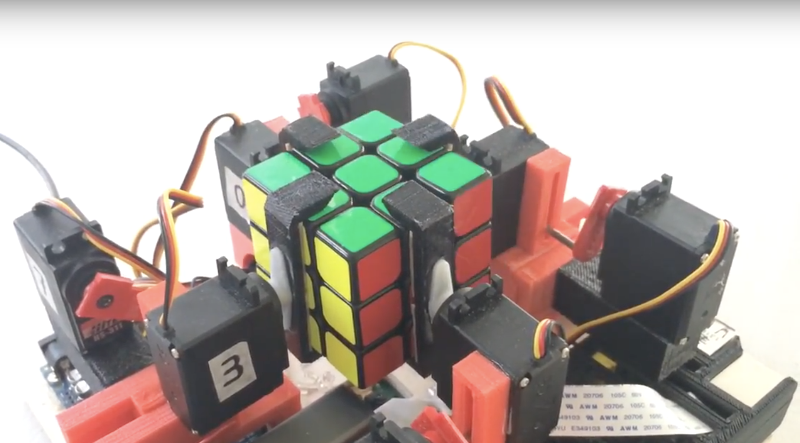

# Rubik's Cube Robot

During the summer after my freshman year, my friend Jake and I built a robot that can solve a Rubik's cube in ~30 seconds. We had a small 3D printer, allowing us to create our design from scratch. We used a Raspberry Pi for the color detection/move planning, an Arduino for the motor control, 8 servo motors, super glue, a wooden board, and our 3D printed parts.

The design took many iterations and tweaks to finally work. One of our more clever solutions involved gluing rubber bands to the inside of our control arms to increase the friction between the arm to hold the cube up.

Having only four arms meant needing to be very smart about arm movement. We used the Kociemba algorithm to solve the cube but needed to customize the solution for our setup. With our highly optimized planning, redundant moves are removed by allowing simultaneous actions to take place.

## Code

The Kociemba algorithm is taken from https://github.com/muodov/kociemba

```convert_moves.py``` converts the output of the Kociemba algorithm to an optimized version for our setup

```robot.ino``` contains the logic for controlling the robot

## Demo

[](https://www.youtube.com/embed/k3oqfdmwf6c "Robot Video")
